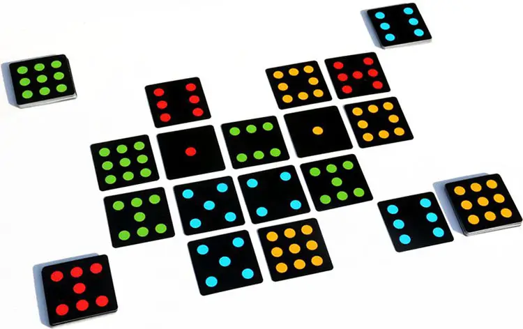
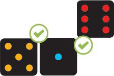
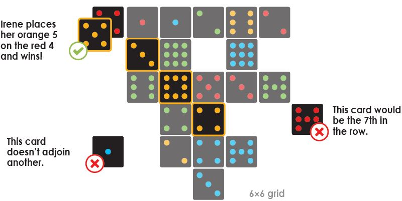
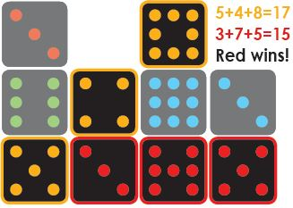

# Punto

## Summary of the project
This is a Punto Game made in C with OCML (based itself on OCL & SFML) libraries, it work as is on Debian based GNU/Linux distro (even WSL).
You can use it on Windows or Mac (using Brew) but i am unsure of the steps to follow to set it up correctly.

## TODO List (Future Plan)
+ Code Rework / Refactoring:
  + Add the Second round.
  + Rework or remove Board scaling.
  + Add Dynamic Board.
  + Add Game Template.
    + Add 3 player and alternative mod.
  + Switch to Vulkan API.

+ U.I Change and tweak:
  + Add UI To select template.
  + Use free OST / FX.
  + Rework Game visual.

## How to play

### Objective of the Game
Be the first player to score either 5 cards (2 players) or 4 cards (3-4 players) of the same color in a row: horizontally, vertically, or diagonally.

### Board Setup
Sort the deck into 4 stacks: 1 of each color. Each player takes the following cards, according to the number of players:
- 2 players: Each player takes 2 sets of color cards.
- 3 players: Each player takes 1 set of color cards. In addition, randomly deal each player 6 cards of whichever color is left over, as a " neutral" color.
- 4 players: Each player takes 1 set of color cards.
Shuffle all of your cards together and stack them face-down in front of you



### Game Play
The first player starts and reveals their top card, placing it in the middle of the play area. Play proceeds left. On each subsequent turn, you reveal your top card and must place it next to or on top of a card already in play.

**Place next to a card:** Cards may be placed side-to-side or corner-to-corner.



**Place on top of a card:** You may only place a card on top of one with fewer points.


**Important:** The playing area has a maximum size of 6x6. Choose wisely where to place your cards !

## Ending the Round
As soon as you've placed 4 (3-4 player) or 5 (2 player) cards of the same color in a row - horizontally, vertically, or diagonally - you win the round!
Take the card with the most points from your winning row and remove it from the game. The remaining cards are all returned to their respective players and shuffled.
After that a new round begins, starting with the player to the left of the previous round s winner.



### Notes for 3 Players
The neutral color does not count towards a victory.
Collect and shuffle all the neutral cards that were played this round, then randomly deal them back to each player, starting with the winner of the round. (Players retain any neutral cards that were still in their deck at the end of the round).
If a round ends in a stalemate, the winner is whoever has the most visible rows of 3 cards (or, in a two-player game, most visible rows of 4 cards).
If there is still a stalemate, whoever placed the row of 3 cards (or, in a two-player game, the row of 4 cards ) showing the fewest points wins.


## End of the Game
The first player to win 2 rounds wins the game.




### Team Variant (for 4 Players)
Team members sit across from one another, so each turn alternates teams and players.
Similar to a two-player game, each team will receive all cards of 2 colors and shuffle them together in a stack, face-down.
Each team member receives half of the shared stack and the First Team To Score 5 Cards Of The Same Color In A Row.


## SETUP

### Clone the repository with Git

```shell
git clone --recurse-submodules git@github.com:Ornsolot/Punto.git
```

### Use the Wizard to install all the dependencies

To use the Wizard, use the following command at the root of the project to install all the libraries and tools necessary to deploy, compile and use the project:

```shell
./wizard.sh $(whoami)
```
Non-exhaustive list of dependencies:
- **Git:** Decentralized version control software.
- **lsb-release:** Shell command that displays information about Linux system's version and distribution.
- **build-essential:** The build-essential meta-package groups together the essential tools for compiling and building software from source code on Debian, tools like **gcc** or **GNU/Make**.
- **libcsfml-dev:** C Multimedia library (technically a binding of a C++ library).
- **libmongoc-dev:** C library to do MongoDB queries.
- **libsqlite3-dev:** C library to do SQLite queries.
- **libmysqlclient-dev:** C library to do MySQL queries.
- **Docker:** Tools used to conteneurise the databases.
- **sqlite3:** The only Database that i couldn't conteneurise...

### Compile Game and deploy the containers
Use this command at the root of the project to deploy the containers mysql, mongo and Neo4J (SQLite is lower) and compile the game executable.

```shell
make all
```
**Or:**
```shell
make Punto db
```

#### Make sqlite3 database
To create the SQLite database use this command at the root of the project.
```shell
sqlite3 data/db/punto.db < data/db/sqlite.sql
```

## How to use

### KEYWORDS
List of parameters to give the executable:
```shell
$Database = sqlite | mysql | mongodb | neo4j
$Player = 2 or 4
$Cycle = 1 to 2,147,483,647 (MAX_64 _INT)
```

### Launch the game
Use this command at the root of the project to launch the game.
```shell
./Punto.exe play $Database $Player
./Punto.exe sqlite 2
```

### Print the Score Board
Use this command at the root of the project to print the Score board.
```shell
./Punto.exe score $Database
./Punto.exe score sqlite
```

### Launch the auto-fill
Use this command at the root of the project to launch the auto-fill.
```shell
./Punto.exe auto $Database $Player $Cycle
./Punto.exe auto sqlite 2 2
```

### Launch the database migration
Use this command at the root of the project to launch migration from a database to another.
```shell
./Punto.exe migrate $Database $Database
./Punto.exe migrate sqlite mysql
```
